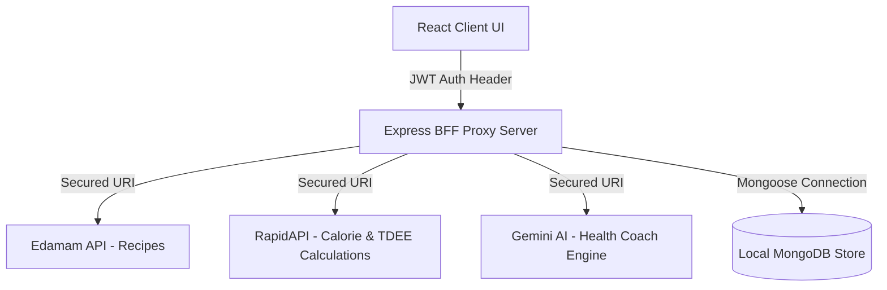

# ⚡ NutriFit AI — Full-Stack Health & Fitness Tracker

[](https://react.dev/)
[](https://nodejs.org/)
[](https://expressjs.com/)
[](https://www.mongodb.com/)
[](https://sass-lang.com/)
[](https://ai.google.dev/)

NutriFit AI is a production-ready, full-stack **MERN (MongoDB, Express, React, Node.js)** fitness platform. It integrates third-party APIs and Google's Gemini AI to offer personal coaching, real-time diet logging, TDEE/anthropometrics calculations, and glassmorphic micro-animations that provide an immersive wellness tracking experience.

---

## 🌟 Key Features

*   **🔐 JWT-Authenticated Sessions:** Custom auth system using `bcryptjs` password hashing and secure token-based persistent sessions.
*   **📊 Dynamic Wellness Dashboard:** 
    *   **Calorie Tracker:** Active budget calculations (Target vs. Consumed).
    *   **Macro Charts:** Responsive distribution visualizations powered by `Recharts`.
    *   **Water Intake & Food logs:** Real-time logging with full CRUD capability.
*   **🥗 BFF (Backend-For-Frontend) Architecture:** All third-party calls (Edamam & RapidAPI) are proxied through Node/Express, securing system API keys from client exposure.
*   **🧠 AI Health Coach:** Gemini AI chat module providing personalized dietary adjustments and activity recommendations based on user profiles.
*   **✨ Premium Animated UI:** Responsive layout decorated with floating cards, fluid transition grids, and custom glassmorphism.

---

## 📐 Architecture & BFF Flow



---

## 📂 Project Structure

```text
My-react-app-main/
├── server/                     # Backend API & Proxy
│   ├── config/                 # DB configuration
│   ├── middleware/             # JWT auth middleware
│   ├── models/                 # Mongoose schemas (User, Profile, Logs)
│   ├── routes/                 # Express API Endpoints (Auth, Recipes, Calories, Coach)
│   ├── server.js               # Express entrypoint
│   └── .env                    # System API Keys & Port Settings
├── src/                        # Frontend React Application
│   ├── components/             # React views (Dashboard, Recipes, Auth)
│   │   └── nested-components/  # Sub-components (Recipe lists, interactive trackers)
│   ├── context/                # Global contexts (AuthContext, RecipesContext)
│   ├── styles/                 # Modular SASS stylesheets (Desktop, Mobile, Tablet)
│   └── utils/                  # Helper data & mockups
├── docker-compose.yml          # Container configuration
└── README.md                   # System documentation
```

---

## 🚀 Local Installation & Run Guide

### Prerequisites
*   [Node.js](https://nodejs.org/) (v16+)
*   [MongoDB Community Server](https://www.mongodb.com/try/download/community) (Running locally on default port `27017`)

---

### Step 1: Clone and Set Up Backend Environment
1. Navigate to the `server/` folder.
2. Create a `.env` file (or update the existing one) with the following structure:

```env
# Server Settings
PORT=5000
NODE_ENV=development

# Database Settings
MONGO_URI=mongodb://127.0.0.1:27017/fitness-tracker

# Security Secrets
JWT_SECRET=super_secret_key_change_me_in_production

# External API Keys (Required for BFF router proxying)
EDAMAM_APP_ID=your_edamam_app_id
EDAMAM_APP_KEY=your_edamam_app_key

RAPID_API_HOST=fitness-calculator.p.rapidapi.com
RAPID_API_KEY=your_rapidapi_key

# AI Service Settings
GEMINI_API_KEY=your_gemini_api_key
```

---

### Step 2: Install Dependencies & Run

#### **Run the Backend API**
```bash
cd server
npm install
npm run dev
```
*   The server will boot on `http://localhost:5000` and output: `MongoDB connected successfully`.

#### **Run the Frontend UI**
Open a new terminal window in the root directory:
```bash
npm install
npm start
```
*   The React app will launch in your browser at `http://localhost:3000`.

---

## 🐳 Running with Docker
The app includes a unified multi-container configuration for quick deployment. Ensure Docker Desktop is active and run:

```bash
docker-compose up --build
```
This launches:
*   **Frontend:** `http://localhost:3000` (Nginx serving React production build)
*   **Backend:** `http://localhost:5000` (Express BFF)
*   **Database:** MongoDB container instance

---

## 🎓 Third-Party API Resources
*   **Recipes:** [Edamam Recipe Search API](https://developer.edamam.com/)
*   **Health Calculator:** [RapidAPI Fitness Calculator](https://rapidapi.com/alexal1/api/fitness-calculator)
*   **AI Engine:** [Google AI Studio (Gemini API)](https://aistudio.google.com/)

---
*Created as part of a high-performance production migration case study.*
